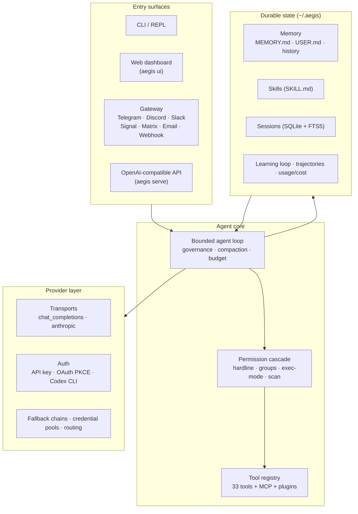
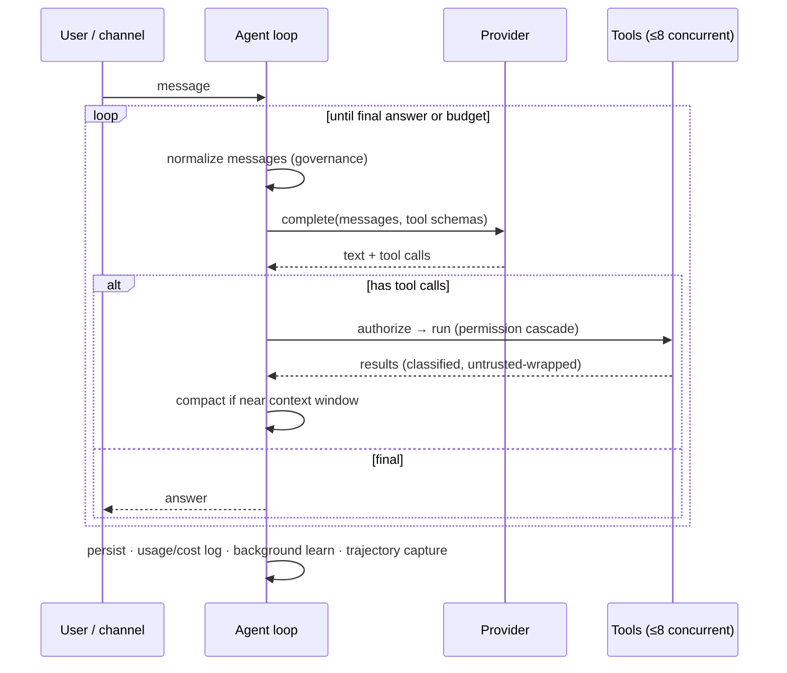

<p align="center"></p>

<p align="center"><b>The terminal AI agent you actually own.</b><br>
Any model · any channel · runs on your machine · learns as it goes — in ~11k auditable lines.</p>

<p align="center">
  <a href="https://github.com/Alien0013/aegis/actions"></a>
  
  
  
  
  
  
</p>

<p align="center">
  <a href="#-install-one-line">Install</a> ·
  <a href="#-quickstart">Quickstart</a> ·
  <a href="#-architecture">Architecture</a> ·
  <a href="#-features">Features</a> ·
  <a href="#-aegis-vs-hermes-vs-openclaw">Comparison</a> ·
  <a href="docs/index.md">Docs</a>
</p>

---

**One command installs a complete AI agent that lives in your terminal, talks to any
model, runs on your machine, and learns as it goes.** AEGIS is an open, self-hostable
alternative to **Hermes Agent** and **OpenClaw** — the same capabilities, distilled into a
core small enough to read in an afternoon.

```bash
curl -fsSL https://raw.githubusercontent.com/Alien0013/aegis/main/install.sh | bash
aegis            # start chatting   ·   aegis ui   # …or a clickable browser UI
```

<p align="center"></p>

## ✨ Why AEGIS is different

|  | What it means |
|---|---|
| 🪶 **Tiny, auditable core** | ~11k lines across 81 modules — you can actually read and trust it. OpenClaw is ~434k lines; Hermes is huge. Same capability, none of the sprawl. |
| 🔌 **Truly model-agnostic** | **28 provider presets** (Claude, GPT, Gemini, Llama, DeepSeek, Qwen, Grok, local Ollama…) behind one interface, with **API-key *and* OAuth** auth, fallback chains, credential pools, and per-prompt routing. |
| 🧠 **It actually learns** | A real closed loop: reviews finished sessions, extracts memory + skills (secret-redacted), promotes them on approval. Optional background review + FTS5 cross-session recall. |
| 🛡️ **Safe by default** | Permission cascade with a **hardline blocklist** (refuses `rm -rf /` even in yolo), pre-exec scanning, **fail-closed** docker/ssh/singularity/modal sandboxes, and untrusted-tool-result wrapping against prompt injection. |
| 📡 **Everywhere you are** | One agent serving CLI, Telegram, Discord, Slack, Signal, Matrix, Email, and webhooks — with voice-memo transcription and a durable, retrying delivery queue. |
| 🧰 **Batteries included** | **33 tools, 26 skills** + hub import, MCP (client **and** server), an OpenAI-compatible API, a web dashboard, cron, trajectory export, cost analytics, and OSV vulnerability auditing. |
| 🔓 **Yours** | MIT, self-hosted, no subscription, no lock-in. Your keys, your data, your machine. |

> Built in the spirit of **NanoClaw**: do what Hermes and OpenClaw do, but keep the whole
> thing small enough to understand — and verify — in one sitting.

## 🏗 Architecture



### The agent loop



## 📦 Install (one line)

```bash
curl -fsSL https://raw.githubusercontent.com/Alien0013/aegis/main/install.sh | bash
```

Finds Python 3.10+, builds an isolated venv at `~/.aegis/venv`, installs the full curated
stack (`.[all]`), drops a global `aegis` launcher on your PATH, installs Playwright
Chromium for browser tools, then launches **guided onboarding** (provider → OAuth/API key →
model → web tools → channels → workspace). Prompts read from `/dev/tty`, so `curl | bash`
works. Variants:

```bash
… | bash -s -- --core            # smaller CLI-only install
… | bash -s -- --advanced        # every channel + memory backend
… | bash -s -- --verify          # run `aegis doctor` afterwards
… | bash -s -- --skip-browser    # no Chromium download
# Windows:  irm https://raw.githubusercontent.com/Alien0013/aegis/main/install.ps1 | iex
```

<details><summary><b>From a clone / for development</b></summary>

```bash
git clone https://github.com/Alien0013/aegis && cd aegis
./install.sh                                  # isolated, global command
# — or editable —
python3 -m venv .venv && . .venv/bin/activate
pip install -e ".[all]" && playwright install chromium
bash scripts/run_tests.sh                     # hermetic offline test run
aegis doctor
```
</details>

Update with `aegis update`; remove with `./uninstall.sh` (`--purge` also deletes `~/.aegis`).

## 🚀 Quickstart

```bash
aegis setup                                   # guided onboarding (re-runnable)
# …or configure directly:
aegis config set ANTHROPIC_API_KEY sk-ant-…   # Claude (API key)
aegis config set OPENAI_API_KEY    sk-…       # OpenAI (API key)
codex login && aegis model set codex gpt-5.5  # ChatGPT subscription via Codex
aegis model set ollama llama3.1               # …or fully local, no key

aegis                                         # interactive REPL (streaming + slash cmds)
aegis chat -q "summarize the files here"      # one-shot
aegis chat --continue                         # resume last session
aegis ui                                      # ← clickable browser UI (great for beginners)
```

## 🧩 Features

### Providers & auth
28 presets — `codex`, `anthropic`, `openai`, `google`, `openrouter`, `groq`, `deepseek`,
`xai`, `mistral`, `together`, `nous`, `ollama`, `lmstudio`, `vllm`, … plus any
OpenAI-compatible endpoint via `model.base_url`. Auth resolves **base_url → API key →
OAuth** (API keys win because some OAuth tokens are identity-only). OAuth is full PKCE S256
with localhost-callback **and** manual-paste, auto-refresh, and `auth.json` at `0600`.
→ [docs/providers.md](docs/providers.md)

### Tools & permissions (33 tools)
`read_file` · `write_file` · `edit_file` · `apply_patch` · `list_dir` · `glob` · `search` ·
`bash` · `process` · `web_fetch` · `web_search` · `http_request` · `download` · `todo_write` ·
`memory` · `skill` · `clarify` (ask the user) · `spawn_subagent` · `generate_image` ·
`execute_code` (RPC sandbox) · `browser` (Playwright) · `computer` (pyautogui) · `lsp` ·
`github` · `dependency_audit` (OSV CVE scan) · every MCP tool (`mcp__server__tool`) and
plugin tools. Results are **classified** (success/error/refused/truncated/partial) and
oversized outputs **spill to disk** to protect the context window. Every dangerous tool
flows through:

```
hardline blocklist  →  deny_groups  →  exec_mode (deny|allowlist|ask|smart|auto|full)  →  allowlist  →  approval
```

### Skills (26 bundled) & the learning loop
`SKILL.md` packages (agentskills.io-compatible) with progressive disclosure and tiered
precedence (workspace > personal > configured > bundled). Bundled set includes
`code-review`, `debugging`, `write-tests`, `refactor`, `commit`, `dockerize`, `kubernetes`,
`web-research`, `data-analysis`, `pdf`/`docx`/`xlsx`/`pptx`, `security-audit`, and more.
The closed loop reviews sessions → proposes redacted memory/skill candidates → promotes on
approval (`aegis learn`), with optional **background review** every N turns.
→ [docs/memory-skills.md](docs/memory-skills.md)

### Memory & recall
Always-on file memory (`MEMORY.md`/`USER.md` + `history.jsonl`), pluggable external backends
(`honcho`, `mem0`, `jsonl`, HTTP), and SQLite sessions with **FTS5 cross-session search**.

### MCP (client + server)
Connect any MCP server (stdio or Streamable HTTP) — tools appear as `mcp__server__tool`;
also reads Claude-Desktop `mcp.json`. Or expose **AEGIS's own** tools/skills/memory as an
MCP server: `aegis mcp serve`. → [docs/mcp.md](docs/mcp.md)

### Channels / gateway
One agent across CLI, Telegram, Discord, Slack, Signal, Matrix, Email, and webhooks — DM
pairing, mention gating, per-channel session isolation, voice-memo transcription, and a
durable retrying delivery queue. → [docs/gateway.md](docs/gateway.md)

```bash
export TELEGRAM_BOT_TOKEN=…
aegis gateway --channels telegram,discord,slack
```

### Serve, schedule, observe
```bash
aegis serve --port 8790        # OpenAI-compatible /v1/chat/completions + /v1/models
aegis cron add "@daily" "summarize today's commits"
aegis trajectory export --format openai   # or hf / sharegpt — fine-tune datasets
aegis cost --days 30           # token-aware, cache-discounted spend by model
aegis insights                 # usage analytics
```

## 📊 AEGIS vs Hermes vs OpenClaw

| | **AEGIS** | Hermes Agent | OpenClaw |
|---|---|---|---|
| Core size | **~11k LOC** | very large | ~434k LOC |
| Providers | **28**, API key **+ OAuth** | many, key-first | several |
| Auth OAuth (Anthropic/OpenAI/Google/Codex) | ✅ full PKCE | partial | partial |
| Hardline safety (even in yolo) | ✅ | ❌ | ❌ |
| Fail-closed sandboxes | ✅ docker/ssh/singularity/modal | partial | partial |
| MCP client **and** server | ✅ | client | client |
| Channels | CLI/TG/Discord/Slack/Signal/Matrix/Email/Webhook | similar | similar |
| Closed learning loop (human-gated) | ✅ + background | background auto | — |
| Trajectory export (jsonl/openai/hf) | ✅ | ✅ | — |
| Cost analytics (cache-aware) | ✅ | ✅ | partial |
| One-line install + GUI on-ramp | ✅ `aegis ui` | pip / desktop | installer |

## 🗂 Repository layout

```
aegis/
├─ agent/            context · governance · compaction · loop · agent
├─ providers/        transports (chat_completions, anthropic) · auth · registry · codex_app_server
├─ tools/            base · permissions · registry · builtin · browser · code_exec · lsp · process …
├─ gateway/          runner · 7 channel adapters · pairing · delivery queue
├─ mcp/              client (stdio+HTTP) · server
├─ cli/              main (40 subcommands) · repl (TUI)
├─ builtin_skills/   26 SKILL.md packages
├─ memory.py  skills.py  session.py  learn.py  curator.py  trajectory.py
├─ usage_log.py  insights.py  dashboard.py  serve.py  cron.py  onboarding.py …
docs/                architecture · providers · gateway · mcp · memory-skills · security …
scripts/run_tests.sh install.sh install.ps1 uninstall.sh
tests/               166 offline tests (fake provider, isolated home)
```

## 🧷 Identity & rules

Drop into `~/.aegis/workspace/` (global) or your project root (local, wins):
`SOUL.md` (persona) · `AGENTS.md`/`.aegis.md`/`CLAUDE.md` (operational rules) · `USER.md` (facts about you).

## ⚙️ Configuration

`~/.aegis/config.yaml` (settings, deep-merged) + `~/.aegis/.env` (API keys only) +
`~/.aegis/auth.json` (OAuth, `0600`). Profiles isolate under `~/.aegis/profiles/<name>/`.
Runtime home is `$AEGIS_HOME` or `~/.aegis`.

## 🛡 Security

Hardline blocklist (irreversible commands refused in every mode), Tirith-style pre-exec
scanning, fail-closed sandbox backends, untrusted-tool-result wrapping, secret redaction in
the learning loop, and `0600` credential files. See [docs/security.md](docs/security.md) and
[SECURITY.md](SECURITY.md). All dependencies carry upper-bound version ceilings
(supply-chain hygiene).

## 🧪 Develop & test

```bash
pip install -e ".[dev]"
bash scripts/run_tests.sh     # hermetic: strips creds, pins UTC, throwaway AEGIS_HOME
```

Contributions welcome — see [CONTRIBUTING.md](CONTRIBUTING.md).

## 📄 License

MIT © Alien0013 — your keys, your data, your machine.
