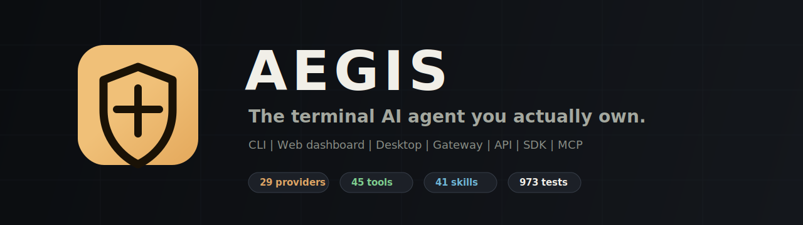
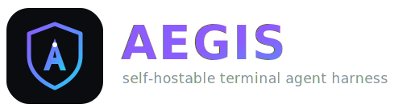
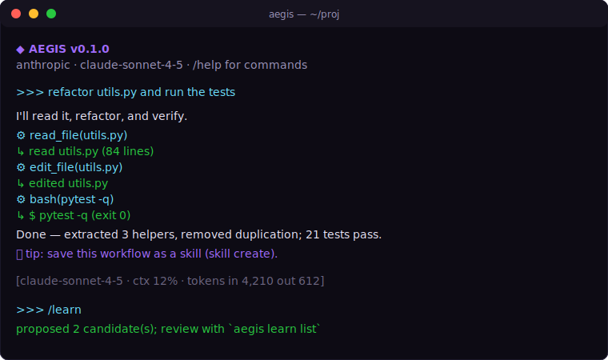
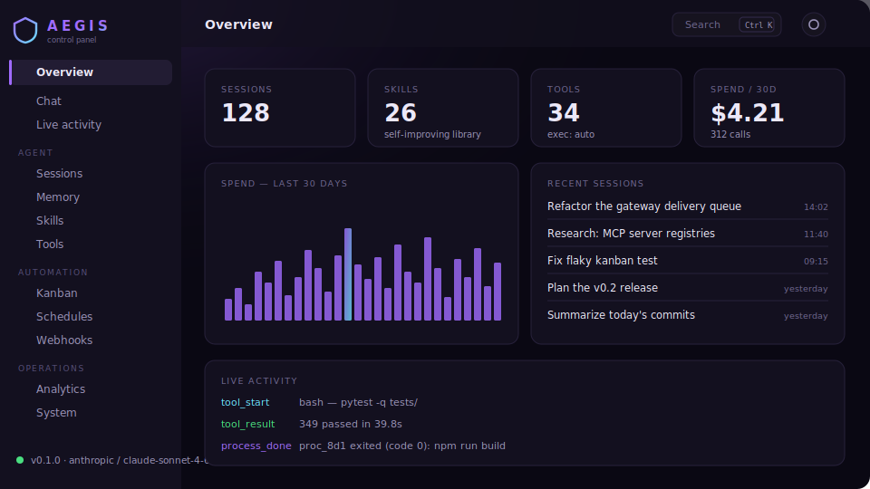
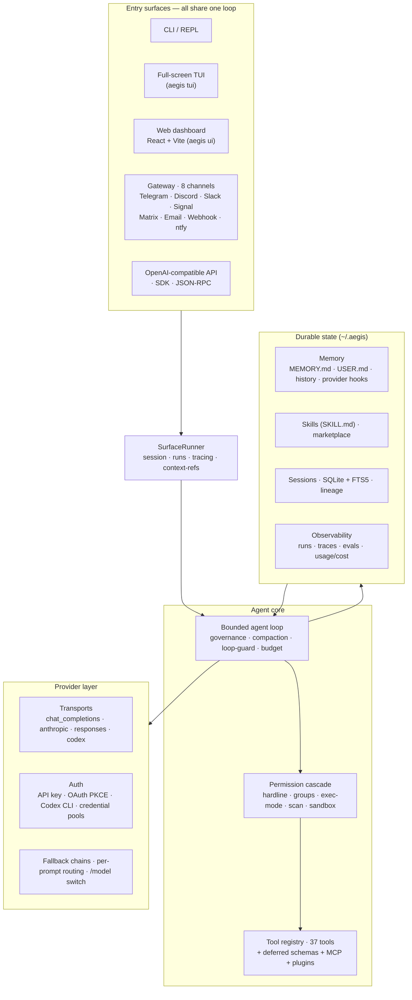
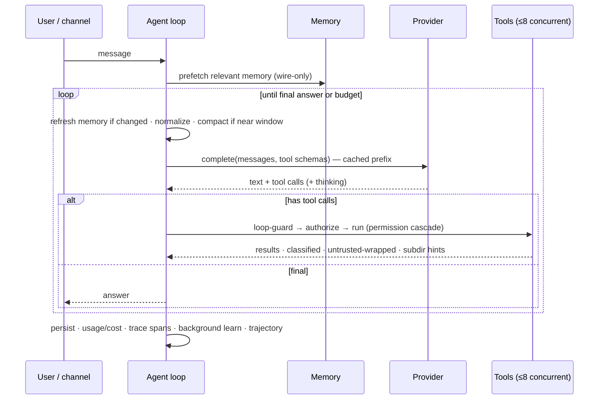
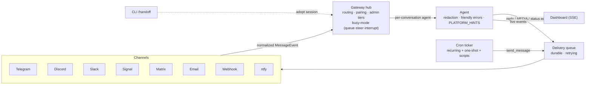
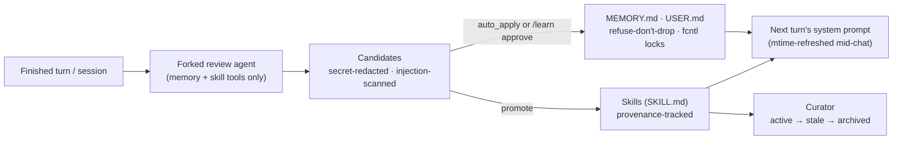
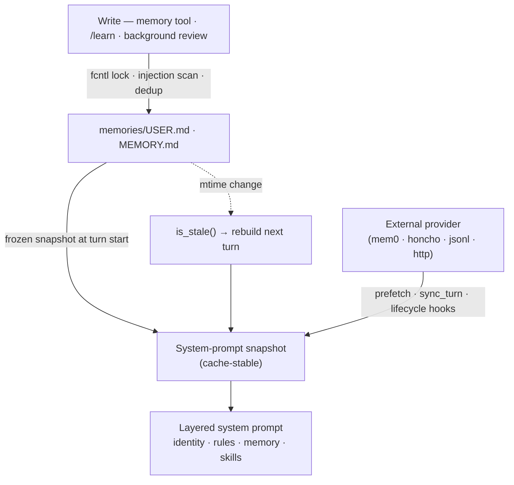

<p align="center"></p>

<p align="center"><b>The terminal AI agent you actually own.</b><br>
Any model · any channel · runs on your machine · learns as it goes — in ~35k auditable lines.</p>

<p align="center">
  <a href="https://github.com/Alien0013/aegis/actions"></a>
  
  
  
  
  
  
  
</p>

<p align="center"></p>

<p align="center">
  <a href="#-install-one-line">Install</a> ·
  <a href="#-quickstart">Quickstart</a> ·
  <a href="#-architecture">Architecture</a> ·
  <a href="#-features">Features</a> ·
  <a href="docs/index.md">Docs</a> ·
  <a href="assets/onepager.html">One-pager</a>
</p>

---

**One command installs a complete AI agent that lives in your terminal, talks to any
model, runs on your machine, and learns as it goes.** AEGIS packs the capabilities of a
full agent platform — multi-provider, multi-channel, self-improving — into an open,
self-hostable core small enough to read in an afternoon.

```bash
curl -fsSL https://raw.githubusercontent.com/Alien0013/aegis/main/install.sh | bash
aegis            # start chatting   ·   aegis ui   # …or a clickable browser UI
```

<p align="center"></p>

<p align="center"><br>
<sub><code>aegis ui</code> — React control panel: streaming chat, cron/model/keys editors, sessions, skills, memory, tools, logs · 3 themes · token-gated</sub></p>

## ✨ Why AEGIS is different

|  | What it means |
|---|---|
| 🪶 **Tiny, auditable core** | ~35k lines across ~95 modules — small enough to read and trust end to end. Full-platform capability, none of the sprawl. |
| 🔌 **Truly model-agnostic** | **29 provider presets** (Claude, GPT, Gemini, Llama, DeepSeek, Qwen, Grok, local Ollama…) behind one interface, with **API-key *and* OAuth** auth, fallback chains, credential pools, and per-prompt routing. |
| 🧠 **It actually learns** | **Autonomous memory** — saves your preferences, facts, and corrections as it works (no asking). Plus a background self-improvement loop that reviews finished sessions, auto-applies memory, and proposes new skills (secret-redacted; skills human-gated by default, fully autonomous with one flag). FTS5 cross-session recall. |
| 🛡️ **Safe by default** | Permission cascade with a **hardline blocklist** (refuses `rm -rf /` even in yolo), pre-exec scanning, **fail-closed** docker/ssh/singularity/modal sandboxes, and untrusted-tool-result wrapping against prompt injection. |
| 📡 **Everywhere you are** | One agent serving CLI, Telegram, Discord, Slack, Signal, Matrix, Email, and webhooks — with voice-memo transcription and a durable, retrying delivery queue. |
| 🧰 **Batteries included** | **37 tools, 29 skills** + hub import, MCP (client **and** server), an OpenAI-compatible API, a web dashboard, cron, trajectory export, cost analytics, and OSV vulnerability auditing. |
| 🔓 **Yours** | MIT, self-hosted, no subscription, no lock-in. Your keys, your data, your machine. |

> Design principle: do everything a full agent platform does, but keep the whole thing
> small enough to understand — and verify — in one sitting.

## 🏗 Architecture

**One agent core, every surface.** Each entry point — terminal, full-screen TUI, React
web UI, an 8-channel gateway, an OpenAI-compatible API, a Python SDK and a JSON-RPC bridge —
routes through the *same* `SurfaceRunner → Agent.run` loop, the same providers, the same
permission cascade, and the same durable state.



### The agent loop



### Multi-channel gateway



### The learning loop



### Memory & state flow



## 📦 Install (one line)

```bash
curl -fsSL https://raw.githubusercontent.com/Alien0013/aegis/main/install.sh | bash
```

Finds Python 3.10+, builds an isolated venv at `~/.aegis/venv`, installs the full curated
stack (`.[all]`), drops a global `aegis` launcher on your PATH, installs Playwright
Chromium for browser tools, then launches **guided onboarding** (provider → OAuth/API key →
model → web tools → channels → workspace). Prompts read from `/dev/tty`, so `curl | bash`
works. Variants:

```bash
… | bash -s -- --core            # smaller CLI-only install
… | bash -s -- --advanced        # every channel + memory backend
… | bash -s -- --verify          # run `aegis doctor` afterwards
… | bash -s -- --skip-browser    # no Chromium download
# Windows:  irm https://raw.githubusercontent.com/Alien0013/aegis/main/install.ps1 | iex
```

<details><summary><b>From a clone / for development</b></summary>

```bash
git clone https://github.com/Alien0013/aegis && cd aegis
./install.sh                                  # isolated, global command
# — or editable —
python3 -m venv .venv && . .venv/bin/activate
pip install -e ".[all]" && playwright install chromium
bash scripts/run_tests.sh                     # hermetic offline test run
aegis doctor
```
</details>

Update with `aegis update`; remove with `./uninstall.sh` (`--purge` also deletes `~/.aegis`).

## 🚀 Quickstart

```bash
aegis setup                                   # guided onboarding (re-runnable)
# …or configure directly:
aegis config set ANTHROPIC_API_KEY sk-ant-…   # Claude (API key)
aegis config set OPENAI_API_KEY    sk-…       # OpenAI (API key)
codex login && aegis model set codex gpt-5.5  # ChatGPT subscription via Codex
aegis model set ollama llama3.1               # …or fully local, no key

aegis                                         # interactive REPL (streaming + slash cmds)
aegis tui                                     # full-screen terminal cockpit
aegis chat -q "summarize the files here"      # one-shot
aegis chat --continue                         # resume last session
aegis ui                                      # ← clickable browser UI (great for beginners)
aegis trace list                              # inspect trace spans/runs
aegis eval run suite.jsonl                    # replay offline eval cases
```

```python
from aegis import AegisClient

client = AegisClient()
result = client.run("Summarize this repo", title="repo summary")
print(result.text, result.session_id, result.trace_id)
```

## 🧩 Features

### Providers & auth
29 presets — `codex`, `anthropic`, `openai`, `google`, `openrouter`, `groq`, `deepseek`,
`xai`, `mistral`, `together`, `ollama`, `lmstudio`, `vllm`, … plus any
OpenAI-compatible endpoint via `model.base_url`. Auth resolves **base_url → API key →
OAuth** (API keys win because some OAuth tokens are identity-only). OAuth is full PKCE S256
with localhost-callback **and** manual-paste, auto-refresh, and `auth.json` at `0600`.
→ [docs/providers.md](docs/providers.md)

### Tools & permissions (37 tools)
`read_file` · `write_file` · `edit_file` · `apply_patch` · `list_dir` · `glob` · `search` ·
`bash` · `process` (with completion wakeups) · `web_fetch` · `web_search` · `http_request` ·
`download` · `todo_write` · `memory` · `skill` · `clarify` (ask the user) ·
`spawn_subagent` (typed: explore/plan/review) · `mixture_of_agents` · `generate_image` ·
`execute_code` (RPC sandbox) · `browser` (Playwright) · `computer` (pyautogui) · `lsp` ·
`github` · `agent_state` · `dependency_audit` (OSV CVE scan) · every MCP tool (`mcp__server__tool`) and
plugin tools. Results are **classified** (success/error/refused/truncated/partial),
oversized outputs **spill to disk**, and rarely-used tools ship **name-only (deferred
schemas)** until `tool_search` activates them — cutting steady-state token overhead.
Every dangerous tool flows through:

```
hardline blocklist  →  deny_groups  →  exec_mode (deny|allowlist|ask|smart|auto|full)  →  allowlist  →  approval
```

### Skills (29 bundled) & the learning loop
`SKILL.md` packages (agentskills.io-compatible) with progressive disclosure and tiered
precedence (workspace > personal > configured > bundled). Bundled set includes
`code-review`, `debugging`, `write-tests`, `refactor`, `commit`, `dockerize`, `kubernetes`,
`web-research`, `data-analysis`, `pdf`/`docx`/`xlsx`/`pptx`, `security-audit`, and more.
The closed loop reviews sessions → proposes redacted memory/skill candidates → promotes on
approval (`aegis learn`), with optional **background review** every N turns.
→ [docs/memory-skills.md](docs/memory-skills.md)

### Memory & recall
Always-on file memory (`MEMORY.md`/`USER.md` + `history.jsonl`), pluggable external backends
(`honcho`, `mem0`, `jsonl`, HTTP), and SQLite sessions with **FTS5 cross-session search**.

### MCP (client + server)
Connect any MCP server (stdio or Streamable HTTP) — tools appear as `mcp__server__tool`;
also reads Claude-Desktop `mcp.json`. Local catalog recipes, install flow, and per-server
tool filters are available through `aegis mcp catalog|install|tools`. Or expose
**AEGIS's own** tools/skills/memory as an MCP server: `aegis mcp serve`.
→ [docs/mcp.md](docs/mcp.md)

### Plugins
Drop-in `*.py` plugins still work, and manifest packages add lifecycle commands:
`aegis plugins install|enable|disable|remove`. → [docs/plugins.md](docs/plugins.md)

### Channels / gateway
One agent across CLI, Telegram, Discord, Slack, Signal, Matrix, Email, and webhooks — DM
pairing, mention gating, per-channel session isolation, voice-memo transcription, and a
durable retrying delivery queue. → [docs/gateway.md](docs/gateway.md)

```bash
export TELEGRAM_BOT_TOKEN=…
aegis gateway --channels telegram,discord,slack
```

### Agentic depth
- **Typed subagents** — `spawn_subagent` with `agent_type: explore | plan | review`
  (read-only tool whitelists, safe to fan out in parallel) and `general`
  children that match Hermes leaf safety: no recursion, `clarify`, memory writes,
  outbound messages, or `execute_code`; child permission prompts auto-deny unless
  `delegation.subagent_auto_approve` is enabled. `continue_id` follow-ups keep
  the child's context.
- **Background re-invocation** — `process start` and background subagents wake the
  agent with their result on the next turn (and announce into the chat on a gateway).
- **Auto-checkpoints with diff** — each turn's edit batch is snapshotted as one unit;
  `/diff` previews it, `/rollback` undoes it (new files removed too). On by default.
- **Mixture-of-agents** — fan one prompt across several models, get one synthesized
  answer with disagreements flagged.
- **Kanban lanes** — `kanban.workers: N` runs parallel board workers; pin a card to
  `lane-K` to serialize related work.
- **`/handoff telegram <chat>`** — move a CLI session (full history) to a messaging
  channel; the gateway adopts it on the next message.
- **Multi-profile gateways** — `gateway.profiles` gives each platform its own
  personality/model/provider on one gateway process.
- **Deep doctor** — `aegis doctor --probe` does a live one-token provider call
  (with latency) and validates Telegram/Discord/Slack tokens; unclean shutdowns
  are detected and DM'd to admins on restart.

### Serve, schedule, observe
```bash
aegis serve --port 8790        # OpenAI-compatible /v1/chat/completions + /v1/models
aegis rpc                      # JSON-RPC stdio agent surface for local bridges
aegis cron add "@daily" "summarize today's commits"
aegis trajectory export --format openai   # or hf / sharegpt — fine-tune datasets
aegis trace list               # trace spans for turns, providers, tools, agents
aegis eval run suite.jsonl     # provider-free replay evals
aegis cost --days 30           # token-aware, cache-discounted spend by model
aegis insights                 # usage analytics
aegis ui                       # cockpit: traces, runs, agents, chat,
                               # kanban, schedules, models, MCP, logs, system
```

The same runtime is embeddable from Python with `from aegis import AegisClient`:
session continuity, progress events, trace lookup, branching, and eval replay all
use the normal AEGIS stores.

## 📊 What you get

| Capability | AEGIS |
|---|---|
| Core size | **~35k LOC**, ~95 modules — auditable end to end |
| Providers | **29 presets**, API key **+ OAuth** (full PKCE for Anthropic/OpenAI/Google/Codex) |
| Safety | hardline blocklist (even in yolo) · pre-exec scanning · fail-closed docker/ssh/singularity/modal sandboxes |
| MCP | client **and** server |
| Channels | CLI · Telegram · Discord · Slack · Signal · Matrix · Email · Webhook · ntfy |
| Learning | autonomous memory + background self-improvement (auto-applies memory, proposes skills; fully autonomous via `learn.auto_apply_skills`) + FTS5 recall |
| Trajectory export | jsonl · openai-finetune · sharegpt |
| Cost analytics | cache-aware, by model |
| On-ramps | one-line install · `aegis ui` browser dashboard with a live activity feed |

## 🗂 Repository layout

```
aegis/                          the Python package (~35k LOC, ~95 modules)
├─ agent/            loop · context · governance · compaction · guardrails · subdir_hints · review
├─ providers/        transports (chat_completions · anthropic · responses · codex) · auth · registry · fallback
├─ tools/            registry · permissions · builtin · browser · code_exec · lsp · process · kanban · environments/ (6 sandboxes)
├─ gateway/          runner · 8 channel adapters · pairing · delivery queue · service
├─ mcp/              client (stdio+HTTP) · server
├─ lsp/              persistent client · 13-language servers · edit diagnostics
├─ cli/              main (47 subcommands) · repl · tui (full-screen) · menu
├─ builtin_skills/   29 SKILL.md packages
├─ static/web_dist/  built React dashboard (served at /)
├─ memory.py · session.py · skills.py · learn.py · curator.py · surface.py
├─ dashboard.py · server.py · sdk.py · rpc.py · runs.py · tracing.py · evals.py · cron.py …
web/                 React + Vite + TypeScript dashboard source (build → aegis/static/web_dist)
docs/                architecture · providers · gateway · mcp · memory-skills · sdk · tracing-evals · security …
assets/              logo · wordmark · banner · diagrams · one-pager
scripts/             run_tests.sh · build_web.sh · verify_e2e.py (18-subsystem live check)
tests/               608 offline tests (fake provider, isolated home) + the live E2E harness
```

## 🧷 Identity & rules

Drop into `~/.aegis/` (global) or your project root (local, wins):
`SOUL.md` (persona) · `AGENTS.md`/`.aegis.md`/`CLAUDE.md` (operational rules) · `USER.md` (facts about you).

## ⚙️ Configuration

`~/.aegis/config.yaml` (settings, deep-merged) + `~/.aegis/.env` (API keys only) +
`~/.aegis/auth.json` (OAuth, `0600`). Profiles isolate under `~/.aegis/profiles/<name>/`.
Runtime home is `$AEGIS_HOME` or `~/.aegis`.

## 🛡 Security

Hardline blocklist (irreversible commands refused in every mode), Tirith-style pre-exec
scanning, fail-closed sandbox backends, untrusted-tool-result wrapping, secret redaction in
the learning loop, and `0600` credential files. See [docs/security.md](docs/security.md) and
[SECURITY.md](SECURITY.md). All dependencies carry upper-bound version ceilings
(supply-chain hygiene).

## 🧪 Develop & test

```bash
pip install -e ".[dev]"
bash scripts/run_tests.sh     # hermetic: strips creds, pins UTC, throwaway AEGIS_HOME
```

Contributions welcome — see [CONTRIBUTING.md](CONTRIBUTING.md).

## 📄 License

MIT © Alien0013 — your keys, your data, your machine.
