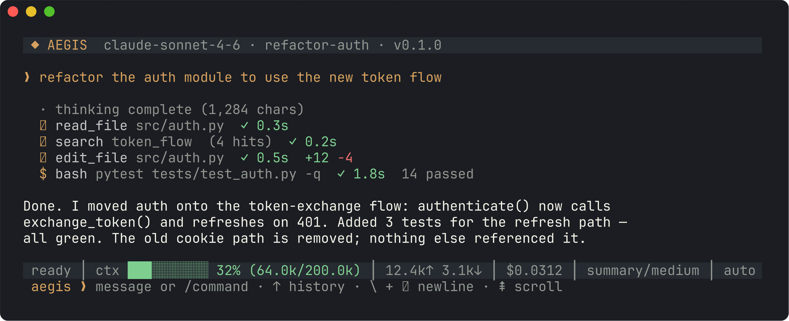
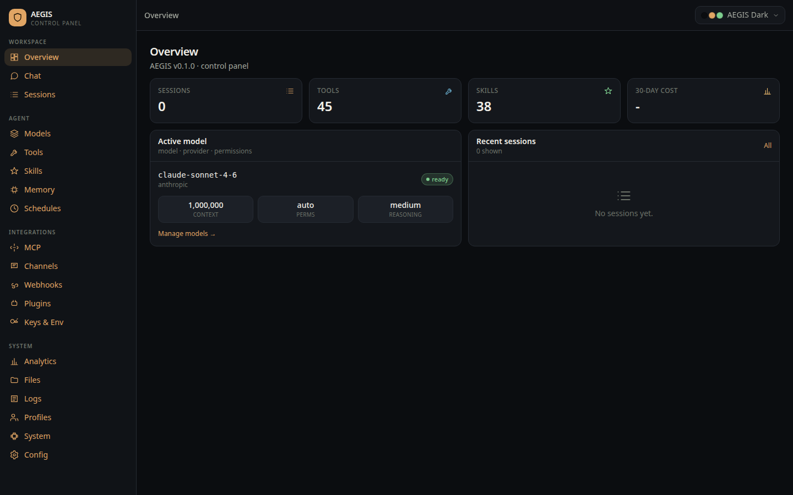
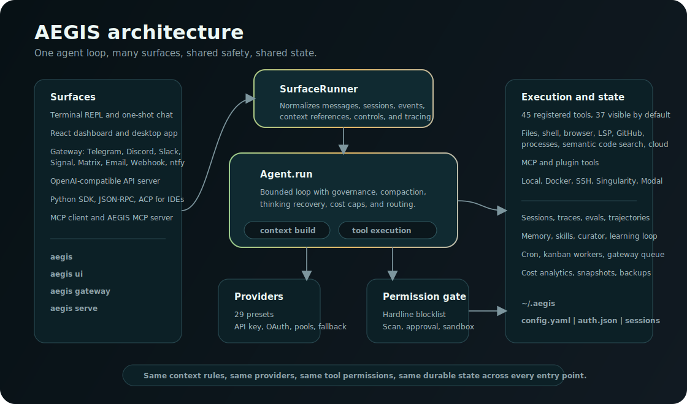
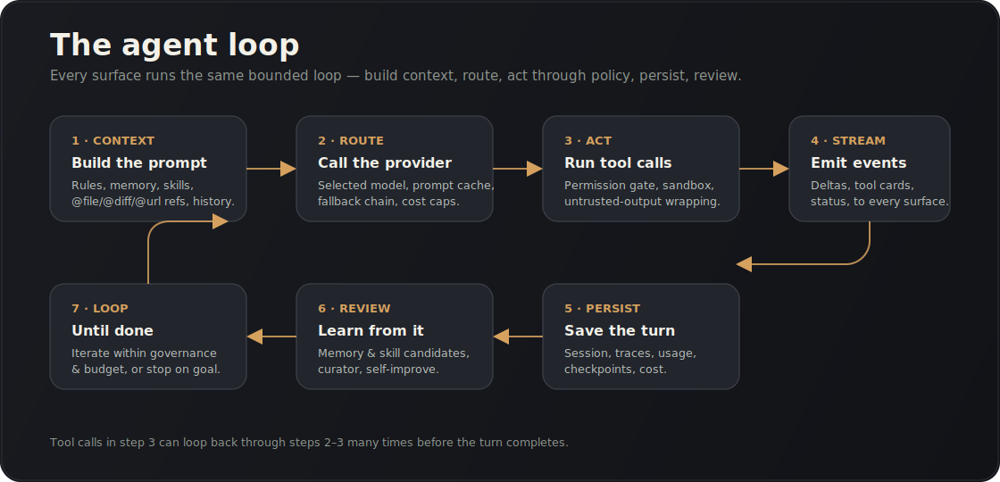

<p align="center"></p>

<p align="center"><b>The local-first agent workbench you actually own.</b><br>
One auditable Python runtime for the terminal, browser dashboard, desktop app, API clients, automation, and MCP.</p>

<p align="center">
  <a href="https://github.com/Alien0013/aegis/actions"></a>
  
  
  
  <a href="docs/index.md"></a>
</p>

<p align="center">
  <a href="#quickstart">Quickstart</a> ·
  <a href="#what-aegis-does-now">What it does</a> ·
  <a href="#run-and-test">Run and test</a> ·
  <a href="#product-polish-remaining">Parity remaining</a> ·
  <a href="docs/index.md">Docs</a>
</p>

---

AEGIS is a self-hostable agent harness for people who want a Codex/Hermes-class
coding and operations assistant without moving the whole workflow into a remote
black box. The same agent loop powers every surface: terminal chat, the local
React dashboard, Electron desktop, OpenAI-compatible API, JSON-RPC, Python SDK,
ACP, MCP, cron, webhooks, and messaging gateways.

State is local by default. Config, secrets, sessions, memory, traces, evals,
checkpoints, logs, and tool output live under `~/.aegis` or `$AEGIS_HOME`.

```bash
curl -fsSL https://raw.githubusercontent.com/Alien0013/aegis/main/install.sh | bash
aegis            # terminal agent
aegis ui         # local browser dashboard
```

<p align="center"></p>

<p align="center"><br>
<sub>The local dashboard opens session-first and includes Chat, Terminal, Live Agents, Overview, Command Center, Models, Tools, Skills, Memory, Persona, Schedules, Kanban, MCP, Channels, Webhooks, Pairing, Accounts, Env, Plugins, Analytics, Files, Logs, Profiles, Docs, System, and Config pages.</sub></p>

## Quickstart

Install, configure a provider, and start chatting:

```bash
aegis setup
aegis secret set ANTHROPIC_API_KEY
aegis model set anthropic claude-sonnet-4-6

aegis
aegis chat -q "summarize this repo"
aegis chat --continue
```

Open the other local surfaces:

```bash
aegis ui --no-open --port 9119       # browser dashboard backend + built UI
aegis desktop                        # Electron shell around the dashboard
aegis serve --port 8790              # OpenAI-compatible API
aegis tui --once                     # terminal cockpit snapshot
```

Use `aegis status`, `aegis tools list`, and `aegis skills list` for live counts
from your current checkout and environment. Optional tools report missing
dependencies instead of failing import.

Run `aegis setup tools --advanced` to revise optional browser, computer, voice,
LSP, and MCP toolsets. The setup step writes the model-visible toolset config
and reports enabled tools, available skills, and plugin tool totals.
Automation can pin the same policy with
`aegis setup tools --non-interactive --accept-risk --toolsets core,mcp --skills web-research,summarize`.

## What AEGIS Does Now

| Area | Current behavior |
| --- | --- |
| Shared runtime | CLI, dashboard, desktop, API, SDK, ACP, MCP, gateway, cron, webhooks, and background work enter through the same `SurfaceRunner` and `Agent.run` path. Live activity snapshots track phase, active model/tool/subagent state, child subagent cards, and run breadcrumbs across surfaces. |
| Terminal agent | Interactive REPL with streaming, slash commands, queued/interruptible turns, long-run status footer, `@file`/`@diff`/`@url` context references, sessions, branching, checkpoints, diff, rollback, goals, traces, and usage. |
| Dashboard | Token-gated FastAPI + React/Vite control panel that opens on sessions, keeps `/dashboard` as a calmer overview, keeps `/agents` focused on running turns/subagents/tools, and keeps `/command-center` as a compact sessions/system/usage ops overlay. It also includes chat, terminal, models, tools, skills, memory, schedules, kanban, MCP, channels, webhooks, pairing, provider accounts, env/secrets, plugins, analytics, files, logs, profiles, docs, system, and config. |
| Desktop | Electron app that launches/probes a local dashboard backend on a random port with a random token, shows boot/retry/log states, remembers window settings, and can run from source or package installers. |
| Providers | Built-in registry for Anthropic, OpenAI, Codex-compatible paths, Google, OpenRouter, Groq, DeepSeek, Qwen/DashScope, xAI, Mistral, Together, Hugging Face, local OpenAI-compatible endpoints, Ollama, LM Studio, vLLM, and more. API-key auth is the default path; OAuth exists where implemented. |
| Tools and permissions | File, patch, shell, process, web, browser, LSP, GitHub, code execution, image generation, subagents, model mixtures, cron/kanban, memory, skills, MCP/plugin tools, and local/cloud helpers all pass through a central registry and permission engine. |
| Memory and skills | File-backed `MEMORY.md`/`USER.md`, SQLite/FTS5 session recall, bundled `SKILL.md` packages, skill creation/improvement, session review, redaction, and approval-based promotion. |
| Automation and evals | `aegis cron`, `aegis kanban`, `aegis spec`, `aegis watch`, `aegis bench`, `aegis eval`, `aegis ab`, traces, runs, cost analytics, backup/import/snapshot, and security/debug reports. |
| API and embedding | OpenAI-compatible `/v1/chat/completions` and `/v1/models`, JSON-RPC stdio, Python SDK, ACP stdio server, MCP client, and `aegis mcp serve`. |

## Run And Test

From a clone:

```bash
git clone https://github.com/Alien0013/aegis
cd aegis
python3 -m venv .venv
. .venv/bin/activate
pip install -e ".[all,dev]"
```

Terminal and core checks:

```bash
python -m aegis.cli.main --help
python -m aegis.cli.main status
python -m aegis.cli.main tools list
bash scripts/run_tests.sh
```

Dashboard:

```bash
aegis ui --no-open --port 9119

# In another terminal for frontend development:
cd web
npm install
npm run dev
npm run typecheck
npm run build

# From the repo root, verify the committed built bundle:
scripts/check_web_dist.sh
```

Desktop:

```bash
aegis desktop --doctor
aegis desktop --install-only
aegis desktop

cd desktop
npm install
npm start
npm run test:desktop
npm run pack
```

`npm run dist`, `npm run dist:linux`, `npm run dist:win`, and `npm run dist:mac`
build installer artifacts when the local platform and signing inputs allow it.
This repository does not claim signed Windows installers or notarized macOS
artifacts are complete unless those release credentials and CI artifacts are
actually present.

OpenAI-compatible API:

```bash
aegis serve --port 8790
curl -s http://127.0.0.1:8790/v1/models
curl -s http://127.0.0.1:8790/v1/chat/completions \
  -H 'Content-Type: application/json' \
  -d '{"model":"default","messages":[{"role":"user","content":"Say hello from AEGIS"}]}'
```

Gateway and automation:

```bash
aegis gateway --channels telegram,discord
aegis cron list
aegis trace list
aegis eval list
aegis security audit
```

Live provider calls and live messaging platform tests require configured
credentials. Use `aegis doctor --probe` only when you intentionally want network
provider probes.

## Architecture

<p align="center"></p>

Every surface enters through the same runtime. That keeps behavior consistent:
a disabled tool stays disabled everywhere; sessions can be resumed from another
surface; memory, permissions, traces, run rows, and usage are shared.

<p align="center"></p>

The loop builds context from rules, memory, skills, and references; routes to the
selected provider; runs tool calls through policy; wraps untrusted outputs;
emits events; persists traces and usage; and can review completed work for
memory or skill candidates.

## Repository Layout

```text
aegis/                  Python package
  agent/                loop, context, compaction, governance, events
  providers/            provider registry, transports, auth, fallback
  tools/                registry, permissions, built-ins, browser, LSP, process, kanban
  gateway/              channel adapters, pairing, routing, delivery queue
  mcp/                  client and server support
  lsp/                  persistent language-server service
  cli/                  parser, REPL, menus
  builtin_skills/       bundled SKILL.md packages
  static/web_dist/      built dashboard served by aegis ui
web/                    React + Vite dashboard source
site-next/              Next.js internals/marketing site
desktop/                Electron shell
docs/                   install, CLI, dashboard, API, SDK, providers, security, parity
assets/                 README images and diagrams
scripts/                test, build, and verification helpers
tests/                  offline regression suite
```

## Product Polish Remaining

AEGIS already has the core local runtime and most product surfaces in place. The
remaining work is mostly proof, visibility, and release polish:

Hermes still feels larger mostly because it has more native product shell around
the same class of agent: a deeper desktop renderer, a richer stateful terminal
TUI, broader platform adapters, mature installer/update flows, and more
generated references. AEGIS is now intentionally session-first in the browser
instead of landing users in an all-in-one admin cockpit.

| Area | Remaining parity work |
| --- | --- |
| Dashboard cockpit | More trace explainability, prompt/context audit, provider capability/probe matrix hardening, fuller tool provenance, background job lifecycle, cron dry-run/next-fire views, and gateway backpressure metrics. |
| Desktop release | Formal lifecycle state machine, packaged smoke artifact verification, crash history/repair UX, release artifact hashes/SBOM, and signed/notarized release evidence when credentials are available. |
| Terminal polish | A richer stateful full-screen TUI, generated slash-command docs, more visual REPL polish, and stronger parity tests for goals, branching, checkpoints, and rollback. |
| API/SDK contracts | Endpoint contract fixtures for chat/completions, responses-style behavior, streaming metadata, auth, cancellation, run events, MCP, and eval replay. |
| Gateway confidence | Fake-adapter contract tests for every channel and explicit live-test instructions for platform credentials. No live Telegram/Discord/Slack/etc. coverage is claimed here. |
| Security and operations | Policy explanation API, network/file safety simulators, broader redaction coverage, release provenance, and one command that proves Python, web, desktop, docs, security, installer, and release checks. |
| Documentation | Generated CLI/API references, page-level dashboard docs, release checklist, and a maintained parity matrix in `docs/feature-parity-matrix.md`. |

## Good To Know

- Optional features need extra dependencies or credentials: browser/computer,
  LSP, voice, vision, provider probes, some gateway channels, and some skills.
- The dashboard binds to `127.0.0.1` by default. Keep the token private if you
  bind it to another interface or place it behind your own auth.
- Back up local state with `aegis backup`; inspect paths with `aegis status`.
- Update with `aegis update`. Remove with `./uninstall.sh`; add `--purge` only
  if you also want to delete `~/.aegis`.

## License

MIT. Your keys, your data, your machine.
