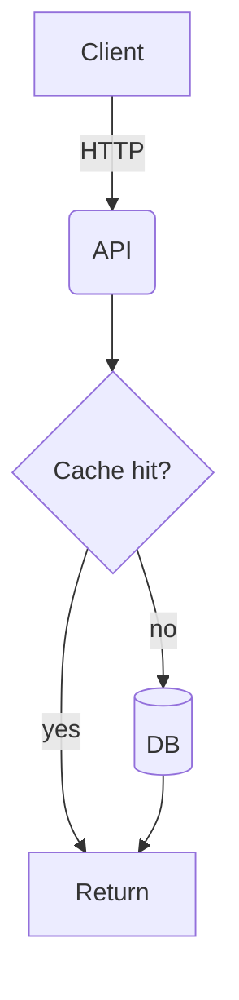

## When to Use
When asked to visualize a system, process, data model, or relationship as a diagram. Mermaid is text-based, renders in GitHub/GitLab/Markdown, and is diff-friendly. Prefer it over binary image formats unless a rendered PNG/SVG is explicitly required.

## Procedure
1. Pick the diagram type from intent: `flowchart` (processes/decisions), `sequenceDiagram` (interactions over time), `erDiagram` (data models), `classDiagram` (OOP), `stateDiagram-v2` (state machines), `architecture-beta` or flowchart subgraphs (system architecture).
2. Draft the Mermaid source. Use clear node IDs and short labels; group related nodes with `subgraph`.
3. Embed in a Markdown fenced block ```` ```mermaid ```` so it renders inline. Use `write_file`/`edit_file` to place it where the doc lives.
4. (Optional) Validate/render to SVG/PNG with the mermaid CLI via `bash` — see Quick Reference.
5. Show the source to the user; iterate on labels/direction if requested.

## Quick Reference
Flowchart (top-down):

Sequence: `sequenceDiagram` then `A->>B: msg`, `B-->>A: reply`, `alt/else/end`, `loop/end`.
ER: `erDiagram` then `USER ||--o{ ORDER : places`.
Directions: `TD` `LR` `BT` `RL`. Render CLI: `npx -y @mermaid-js/mermaid-cli -i in.mmd -o out.svg`.

## Pitfalls
- Special chars in labels (`(`, `:`, `#`, `"`) break parsing — wrap label in quotes: `A["a (b)"]`.
- Edge label syntax is `-->|text|`, not `-->[text]`.
- `architecture-beta` needs a recent Mermaid version; fall back to `flowchart` + `subgraph` for portability.
- Keep diagrams focused; split a sprawling graph into several smaller ones.
- Node IDs must be unique and alphanumeric; labels go in brackets, not the ID.

## Verification
- Confirm the fence is exactly ```` ```mermaid ````.
- If rendering: `npx -y @mermaid-js/mermaid-cli -i diagram.mmd -o diagram.svg` exits 0 and produces the file.
- Otherwise paste source into a Mermaid live editor / GitHub preview to confirm it renders without parse errors.
